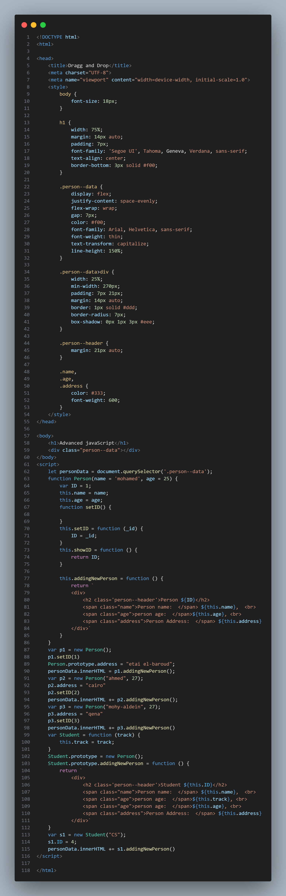
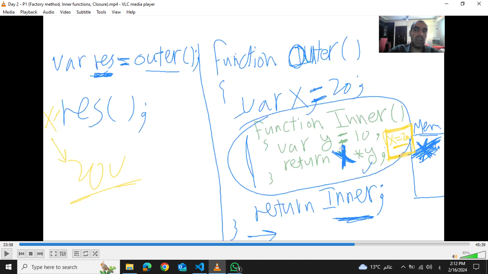

# Advanced javaScript
## Functions
special data type, in js function is an object we have Built-On constructor called `Function` every time we creating instance of this's object, and this's the main reason of why we can using function as paramater in another function (callback)
### way of creating function 
- Declarative Way
    - Hoisted 
    - Parsed once

**Example**
```
function AddingTwoNumbers(a,b){
    return a + b; 
}
console.log(AddingTwoNumbers(5,2))
```
- Dynamic Way
this's function reconstructed every time function invoked

**Example**
```
let NumSumettion = new Function('a','b','return a + b'); 

let result = NumSumettion(5,2); 
console.log(result)
```
- Literal Way
```
var AddingNums = function(a,b){
    return a+b
}
console.log(AddingNums(2,5))
```
## How To Create Custom Object (Class)
- constructor function 
```
function Person(name="person", age=24){
    
    var ID = 0; //Private member
    
    this.name = name; //public member
    this.age = age; // public member
    
    this.displayPerson = function(){
        console.log("person name: "+ this.name, "person age"+this.age)
    } // public method

    function setID(_id){
        id = _id; 
    } //private method

    this.getID = function(){
        return ID; 
    } // public method

}

var p1 = new Person("person 1", 24); 
p1.displayPerson() // person name: person 1 , person age: 24
```
in javascript we can adding new properities to Object(Dynamic properity) in the run time like that `p1.address = 'new address';`
- literal notation | anonymous object
```
var Person = {
    "name": "person name", 
    age: 21
}

console.log(Person.name) // person name
```

#### prototype
proprty holds all member proprity inside class `className.prototype.newProperity = value;` 

[show code](javaScriptObject.html) .

### clouser
when inner function need data from it's parent and parent excuted and finished, clouser will taking copy of parent data

### OOP in ES6
- adding `class` keyword, but also it still special function. 
```
class Person{
    
    constructor(name, age) {
        this.name = name; 
        this.age = age; 
    }
    
    get personName(){
        return this.name;
    }

    set personName(name){
        this.name = name; 
    }

    personInfo(){
        console.log(`name is: ${this.name}, age is: ${this.age}`);
    }
}

class Employee extends Person {
     a = 1; //public
     #b = 2; // private
     static #c = 3 //static and private
    constructor(name, age, salary) {
        super(name, age); 
        this.salary = salary; 
    }
    EmployeInfo(){
        console.log("Employee info"); 
        super.personInfo(); 
    }
    incrementB() {
        this.#b++
    }
}

let student = new Person("student", 25); 
cosole.log(student.personName()); //student
student.personName("new name"); 
console.log(student.name()); //new name
```
- `Function.prototype.call()` method calls a function with a given `this` value and arguments provided individually
- `Function.prototype.aplly()`like `.call` but deffirent in the way of calling 
